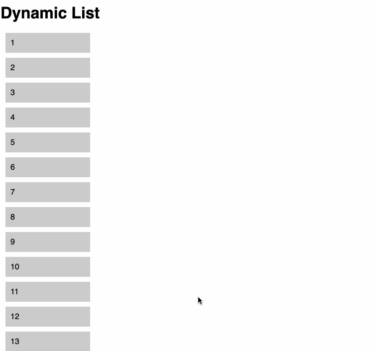
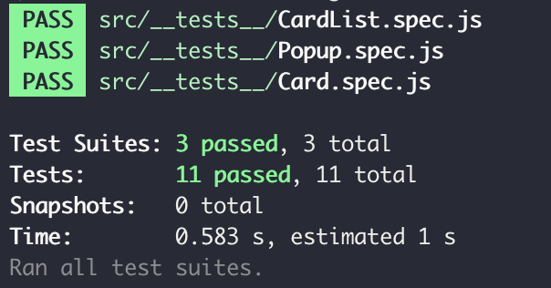

# Dynamic List ⚡️

Implemented in vanilla JS only without any other JS frameworks or libraries.



Here's what **Dynamic List** does

- It will load only **30 items** but will display more up to **100** by scroll event.
- A hovered item in the list shifts **40px** right.
- The items right up and down of the hovered item shift **20px** right.
- Should return the position when other item is hovered.
- If you click a item in the list, the clicked DOM should resize itself to pop out.
- Should be able to close the popped out DOM by clicking outside of the popup area.

## Development

### Extra Tech Stacks

These are used only for setting up this project. Nothing more than that. 😉

- [yarn](https://yarnpkg.com/) for package management
- [parceljs](https://parceljs.org/) as a complier & bundler(only for handly local dev env setting)
- [jest](https://jestjs.io/) for unit tests
- [eslint](http://eslint.org/) for linting

### To run dev mode locally:

```bash
  $ git clone https://github.com/AhyoungRyu/dynamic-list.git
  $ cd dynamic-list
  $ yarn install
  # After successfull pkg installtion
  $ yarn start
```

Now, it will take you to http://localhost:1234

### To run unit test:

```bash
  $ yarn test
```



It will run all unit tests in `*.spec.js` files under `__tests__` folder.
